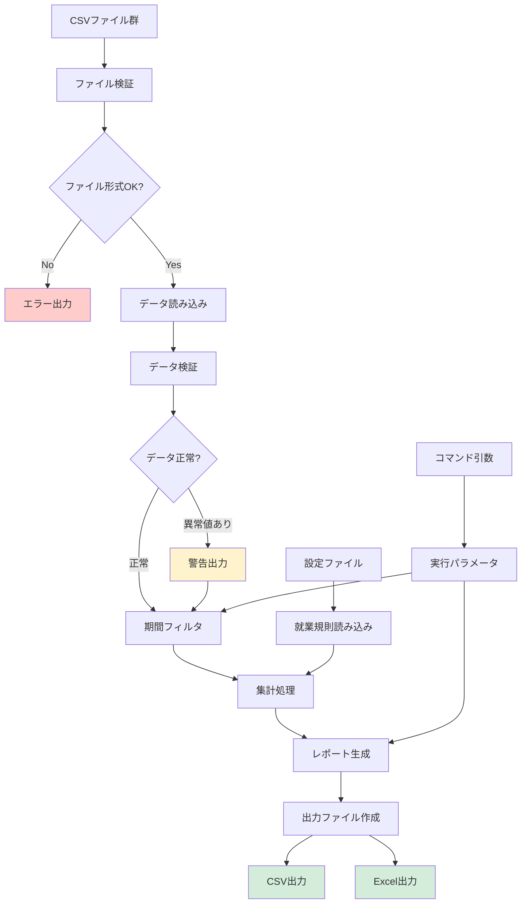
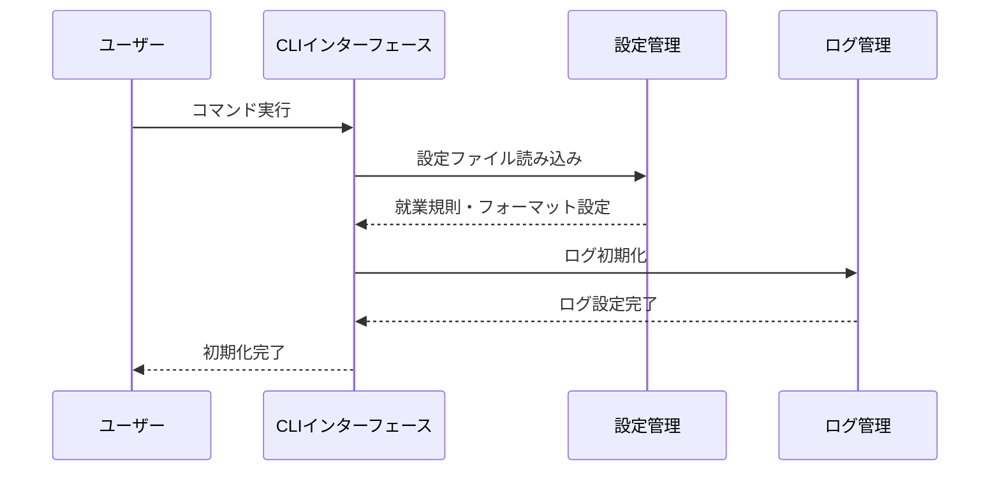
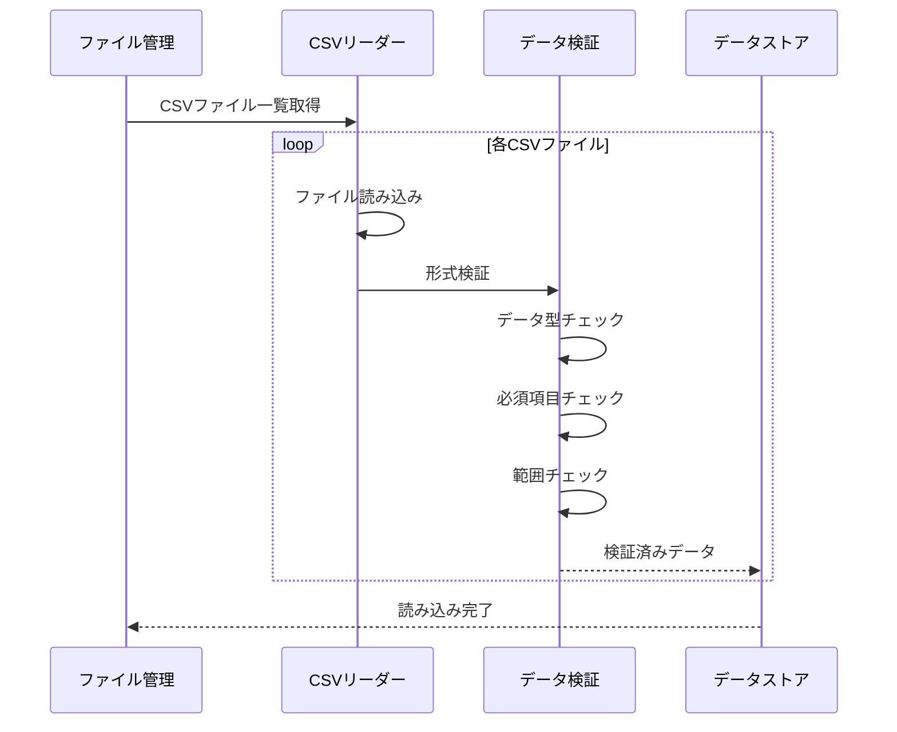
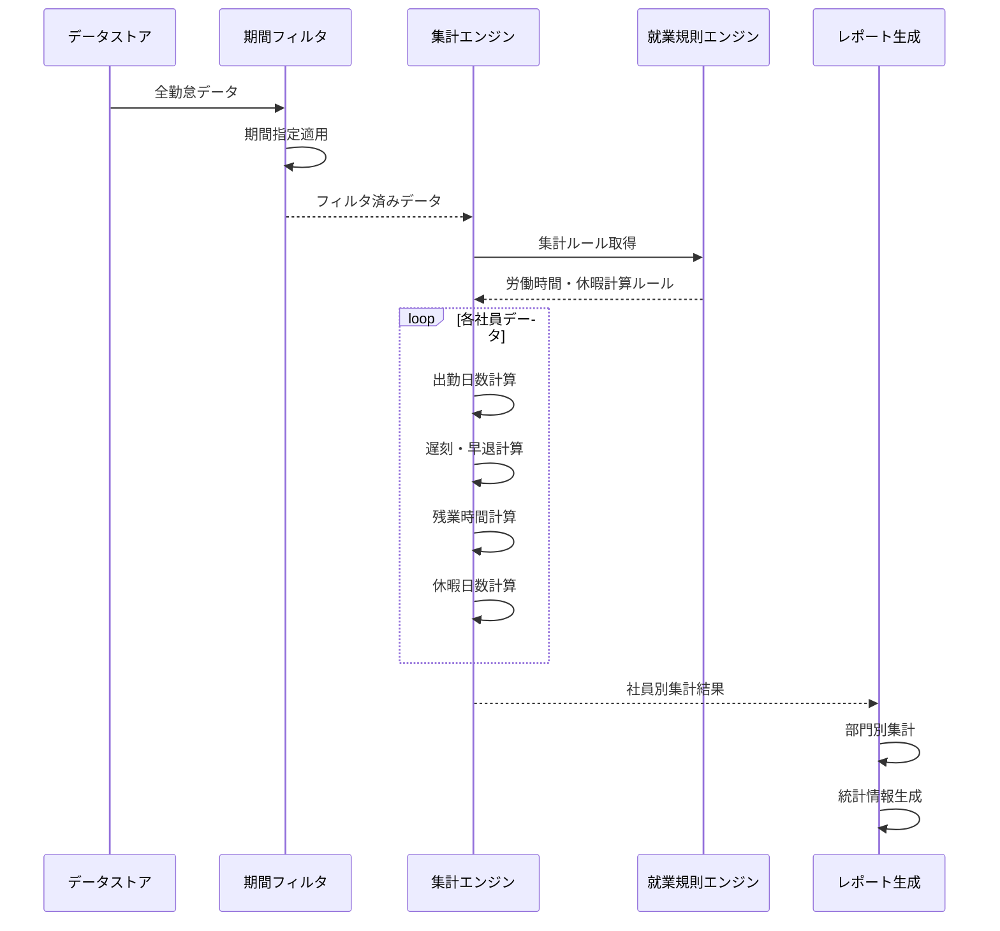
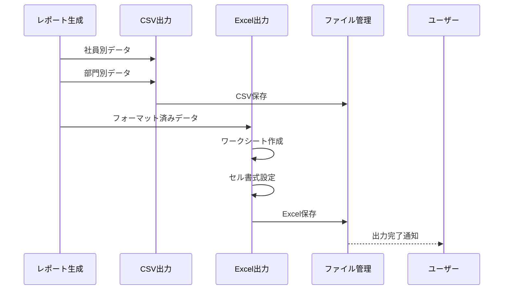
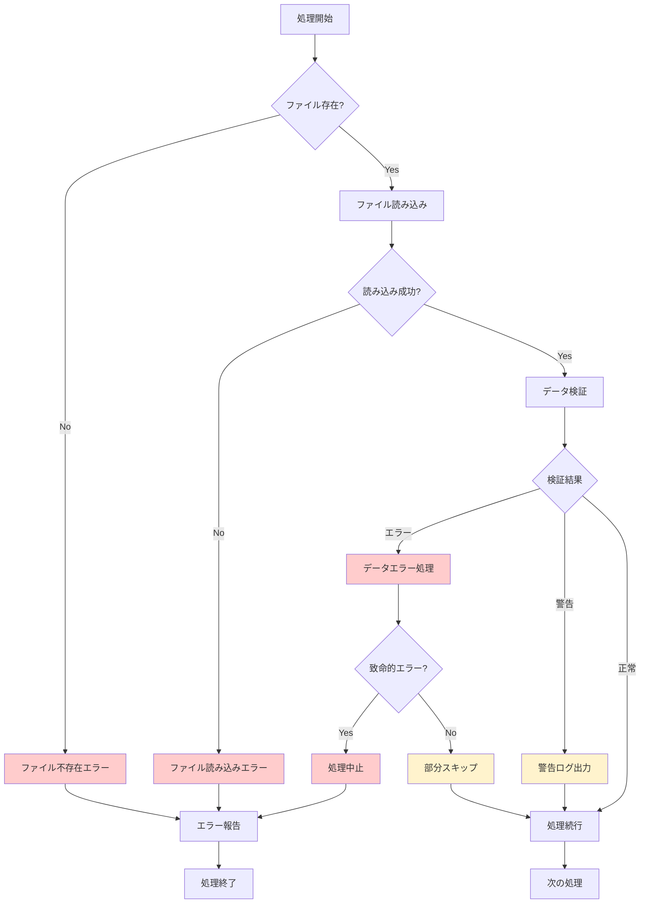
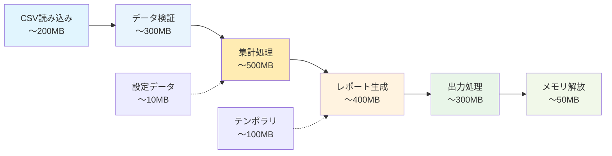
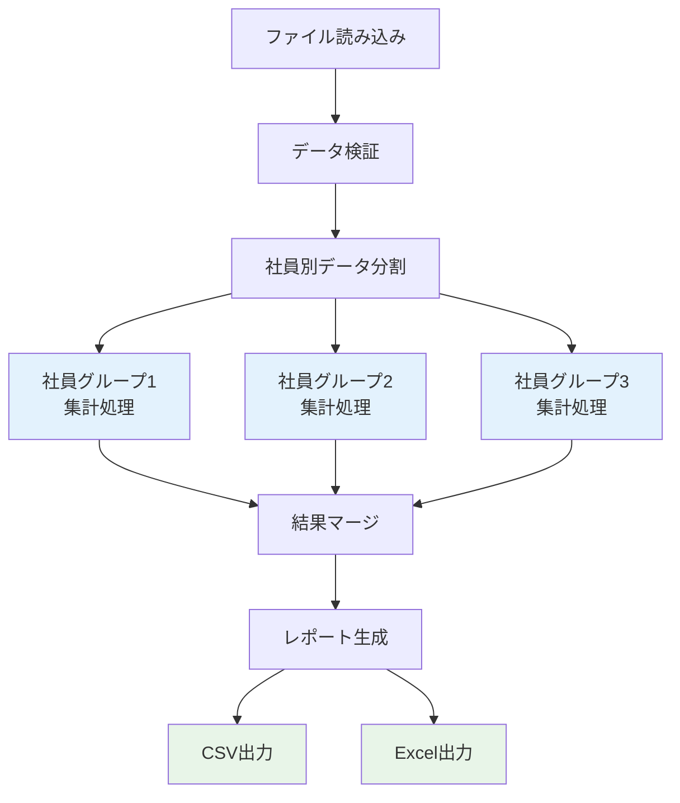
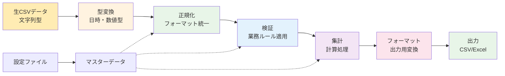

# データフロー図

## システム全体のデータフロー

```mermaid
flowchart TD
    A[CSVファイル群] --> B[ファイル検証]
    B --> C{ファイル形式OK?}
    C -->|No| D[エラー出力]
    C -->|Yes| E[データ読み込み]
    
    E --> F[データ検証]
    F --> G{データ正常?}
    G -->|異常値あり| H[警告出力]
    G -->|正常| I[期間フィルタ]
    H --> I
    
    I --> J[集計処理]
    J --> K[レポート生成]
    K --> L[出力ファイル作成]
    
    M[設定ファイル] --> N[就業規則読み込み]
    N --> J
    
    O[コマンド引数] --> P[実行パラメータ]
    P --> I
    P --> K
    
    L --> Q[CSV出力]
    L --> R[Excel出力]
    
    style D fill:#ffcccc
    style H fill:#fff3cd
    style Q fill:#d4edda
    style R fill:#d4edda
```

## 詳細処理フロー

### 1. 初期化フェーズ

```mermaid
sequenceDiagram
    participant User as ユーザー
    participant CLI as CLIインターフェース
    participant Config as 設定管理
    participant Logger as ログ管理
    
    User->>CLI: コマンド実行
    CLI->>Config: 設定ファイル読み込み
    Config-->>CLI: 就業規則・フォーマット設定
    CLI->>Logger: ログ初期化
    Logger-->>CLI: ログ設定完了
    CLI-->>User: 初期化完了
```

### 2. データ取り込みフェーズ

```mermaid
sequenceDiagram
    participant File as ファイル管理
    participant Reader as CSVリーダー
    participant Validator as データ検証
    participant Store as データストア
    
    File->>Reader: CSVファイル一覧取得
    loop 各CSVファイル
        Reader->>Reader: ファイル読み込み
        Reader->>Validator: 形式検証
        Validator->>Validator: データ型チェック
        Validator->>Validator: 必須項目チェック
        Validator->>Validator: 範囲チェック
        Validator-->>Store: 検証済みデータ
    end
    Store-->>File: 読み込み完了
```

### 3. データ処理フェーズ

```mermaid
sequenceDiagram
    participant Store as データストア
    participant Filter as 期間フィルタ
    participant Calculator as 集計エンジン
    participant Rules as 就業規則エンジン
    participant Report as レポート生成
    
    Store->>Filter: 全勤怠データ
    Filter->>Filter: 期間指定適用
    Filter-->>Calculator: フィルタ済みデータ
    
    Calculator->>Rules: 集計ルール取得
    Rules-->>Calculator: 労働時間・休暇計算ルール
    
    loop 各社員データ
        Calculator->>Calculator: 出勤日数計算
        Calculator->>Calculator: 遅刻・早退計算
        Calculator->>Calculator: 残業時間計算
        Calculator->>Calculator: 休暇日数計算
    end
    
    Calculator-->>Report: 社員別集計結果
    Report->>Report: 部門別集計
    Report->>Report: 統計情報生成
```

### 4. 出力フェーズ

```mermaid
sequenceDiagram
    participant Report as レポート生成
    participant CSVWriter as CSV出力
    participant ExcelWriter as Excel出力
    participant File as ファイル管理
    participant User as ユーザー
    
    Report->>CSVWriter: 社員別データ
    Report->>CSVWriter: 部門別データ
    CSVWriter->>File: CSV保存
    
    Report->>ExcelWriter: フォーマット済みデータ
    ExcelWriter->>ExcelWriter: ワークシート作成
    ExcelWriter->>ExcelWriter: セル書式設定
    ExcelWriter->>File: Excel保存
    
    File-->>User: 出力完了通知
```

## エラーハンドリングフロー

```mermaid
flowchart TD
    A[処理開始] --> B{ファイル存在?}
    B -->|No| C[ファイル不存在エラー]
    B -->|Yes| D[ファイル読み込み]
    
    D --> E{読み込み成功?}
    E -->|No| F[ファイル読み込みエラー]
    E -->|Yes| G[データ検証]
    
    G --> H{検証結果}
    H -->|エラー| I[データエラー処理]
    H -->|警告| J[警告ログ出力]
    H -->|正常| K[処理続行]
    
    I --> L{致命的エラー?}
    L -->|Yes| M[処理中止]
    L -->|No| N[部分スキップ]
    
    J --> K
    N --> K
    K --> O[次の処理]
    
    C --> P[エラー報告]
    F --> P
    M --> P
    P --> Q[処理終了]
    
    style C fill:#ffcccc
    style F fill:#ffcccc
    style I fill:#ffcccc
    style M fill:#ffcccc
    style J fill:#fff3cd
    style N fill:#fff3cd
```

## メモリ使用量フロー

```mermaid
graph LR
    A[CSV読み込み<br/>～200MB] --> B[データ検証<br/>～300MB]
    B --> C[集計処理<br/>～500MB]
    C --> D[レポート生成<br/>～400MB]
    D --> E[出力処理<br/>～300MB]
    E --> F[メモリ解放<br/>～50MB]
    
    G[設定データ<br/>～10MB] -.-> C
    H[テンポラリ<br/>～100MB] -.-> D
    
    style A fill:#e1f5fe
    style B fill:#e8f4fd
    style C fill:#ffecb3
    style D fill:#fff3e0
    style E fill:#e8f5e8
    style F fill:#f1f8e9
```

## 並列処理可能ポイント

```mermaid
graph TD
    A[ファイル読み込み] --> B[データ検証]
    B --> C[社員別データ分割]
    
    C --> D1[社員グループ1<br/>集計処理]
    C --> D2[社員グループ2<br/>集計処理]
    C --> D3[社員グループ3<br/>集計処理]
    
    D1 --> E[結果マージ]
    D2 --> E
    D3 --> E
    
    E --> F[レポート生成]
    F --> G1[CSV出力]
    F --> G2[Excel出力]
    
    style D1 fill:#e3f2fd
    style D2 fill:#e3f2fd
    style D3 fill:#e3f2fd
    style G1 fill:#e8f5e8
    style G2 fill:#e8f5e8
```

## データ変換フロー

```mermaid
flowchart LR
    A[生CSVデータ<br/>文字列型] --> B[型変換<br/>日時・数値型]
    B --> C[正規化<br/>フォーマット統一]
    C --> D[検証<br/>業務ルール適用]
    D --> E[集計<br/>計算処理]
    E --> F[フォーマット<br/>出力用変換]
    F --> G[出力<br/>CSV/Excel]
    
    H[設定ファイル] --> I[マスターデータ]
    I -.-> C
    I -.-> D
    I -.-> E
    
    style A fill:#ffecb3
    style B fill:#fff3e0
    style C fill:#e8f5e8
    style D fill:#e3f2fd
    style E fill:#f3e5f5
    style F fill:#fce4ec
    style G fill:#e8f5e8
```