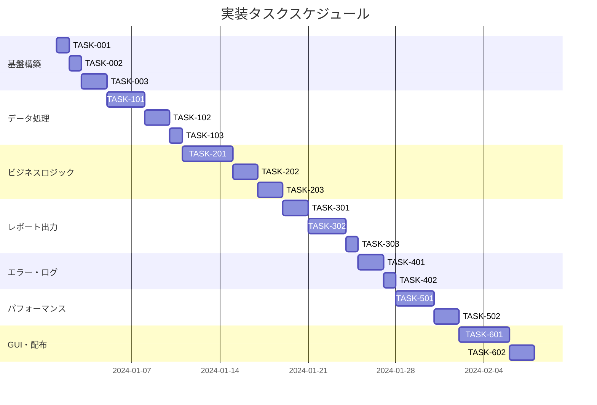

# 勤怠管理自動集計ツール 実装タスク

## 概要

全タスク数: 25
推定作業時間: 40-50時間
クリティカルパス: TASK-001 → TASK-002 → TASK-003 → TASK-101 → TASK-102 → TASK-201 → TASK-202 → TASK-301

## タスク一覧

### フェーズ1: 基盤構築・環境設定

#### TASK-001: プロジェクト構造・環境設定

- [x] **タスク完了**
- **タスクタイプ**: DIRECT
- **要件リンク**: REQ-402 (Windows 10/11環境での実行)
- **依存タスク**: なし
- **実装詳細**:
  - プロジェクト構造の作成（src/, tests/, config/, data/, output/）
  - pyproject.tomlまたはsetup.pyの設定
  - requirements.txtの作成（pandas, openpyxl, click, pydantic等）
  - 開発用requirements-dev.txtの作成（pytest, black, mypy等）
  - .gitignoreの設定
  - READMEファイルの作成
- **テスト要件**:
  - [ ] パッケージインストールテスト
  - [ ] プロジェクト構造の検証テスト
- **完了条件**:
  - [ ] 仮想環境でのパッケージインストール成功
  - [ ] ディレクトリ構造が設計通りに作成されている

#### TASK-002: 設定ファイル・ログ設定

- [x] **タスク完了**
- **タスクタイプ**: DIRECT  
- **要件リンク**: REQ-404 (就業規則準拠), NFR-202 (処理進捗表示)
- **依存タスク**: TASK-001
- **実装詳細**:
  - config/work_rules.yaml - 就業規則設定
  - config/csv_format.yaml - CSVフォーマット設定
  - config/logging.yaml - ログ設定
  - 環境変数による設定オーバーライド機能
- **テスト要件**:
  - [ ] 設定ファイル読み込みテスト
  - [ ] 設定値バリデーションテスト
- **完了条件**:
  - [ ] 各設定ファイルが正しく読み込める
  - [ ] ログが設定通りに出力される

#### TASK-003: CLIインターフェース基盤

- [x] **タスク完了**
- **タスクタイプ**: TDD
- **要件リンク**: NFR-201 (CLI実行), REQ-101,102 (期間指定)
- **依存タスク**: TASK-002
- **実装詳細**:
  - clickライブラリによるCLI構築
  - コマンドライン引数の定義（入力パス、出力パス、期間等）
  - ヘルプメッセージとバリデーション
  - プログレスバー表示機能
- **テスト要件**:
  - [ ] 単体テスト: 引数パース機能
  - [ ] 統合テスト: コマンドライン実行
  - [ ] エラーケーステスト: 不正引数
- **エラーハンドリング**:
  - [ ] 不正な引数値
  - [ ] 必須引数の不足
  - [ ] ファイルパスの不正

### フェーズ2: データ処理基盤

#### TASK-101: CSVファイル読み込み・検証機能

- [x] **タスク完了**
- **タスクタイプ**: TDD
- **要件リンク**: REQ-001 (CSV取り込み), REQ-201,202 (エラーハンドリング)
- **依存タスク**: TASK-003
- **実装詳細**:
  - pandasによるCSV読み込み機能
  - ファイル形式検証（エンコーディング、区切り文字）
  - カラム存在チェック・型変換
  - エラーログ・警告ログ出力
- **テスト要件**:
  - [ ] 単体テスト: 正常CSV読み込み
  - [ ] 単体テスト: 各種異常CSVの処理
  - [ ] 境界値テスト: 大容量ファイル
- **エラーハンドリング**:
  - [ ] ファイル不存在 (EDGE-001)
  - [ ] 不正フォーマット (REQ-202)
  - [ ] 文字化け (EDGE-205)
  - [ ] 空ファイル (EDGE-106)

#### TASK-102: データ検証・クレンジング機能

- [x] **タスク完了**
- **タスクタイプ**: TDD
- **要件リンク**: REQ-103,104,105 (異常値検出), EDGE-201-205
- **依存タスク**: TASK-101
- **実装詳細**:
  - pydanticによるデータモデル定義
  - 業務ルールに基づく検証ロジック
  - 異常値・欠損値の検出と警告
  - データ不整合の修正提案機能
- **テスト要件**:
  - [ ] 単体テスト: 各検証ルール
  - [ ] 境界値テスト: 24時間勤務等
  - [ ] 統合テスト: 検証フロー全体
- **エラーハンドリング**:
  - [ ] 出勤時刻＞退勤時刻 (EDGE-201)
  - [ ] 負の勤務時間 (REQ-104)
  - [ ] 24時間超勤務 (REQ-104)
  - [ ] 未来日データ (EDGE-204)

#### TASK-103: 期間フィルタリング機能

- [x] **タスク完了**
- **タスクタイプ**: TDD
- **要件リンク**: REQ-101,102 (期間指定集計)
- **依存タスク**: TASK-102
- **実装詳細**:
  - 月単位・日付範囲でのデータフィルタリング
  - python-dateutilによる柔軟な日付処理
  - うるう年対応・月末日処理
- **テスト要件**:
  - [x] 単体テスト: 月単位フィルタ
  - [x] 単体テスト: 日付範囲フィルタ
  - [x] 境界値テスト: うるう年2月29日
- **完了条件**:
  - [x] 正確な期間フィルタリング
  - [x] エッジケース対応完了

### フェーズ3: ビジネスロジック実装

#### TASK-201: 勤怠集計エンジン

- [x] **タスク完了**
- **タスクタイプ**: TDD
- **要件リンク**: REQ-002-008 (各種集計機能)
- **依存タスク**: TASK-103
- **実装詳細**:
  - 出勤・欠勤日数の集計ロジック
  - 遅刻・早退回数の計算
  - 残業時間の算出（法定・所定）
  - 有給・特別休暇日数の集計
- **テスト要件**:
  - [x] 単体テスト: 各集計ロジック
  - [x] 統合テスト: 月次集計処理
  - [x] 境界値テスト: 0分勤務、24時間勤務
- **UI/UX要件**:
  - [x] プログレスバー: 集計進捗表示（基本構造実装）
  - [x] ステータス表示: 現在の処理内容（基本構造実装）
- **完了条件**:
  - [x] 就業規則に準拠した正確な集計
  - [x] 100名分データを5分以内で処理

#### TASK-202: 就業規則エンジン

- [x] **タスク完了**
- **タスクタイプ**: TDD
- **要件リンク**: REQ-404 (就業規則準拠), REQ-105 (労働時間上限)
- **依存タスク**: TASK-201
- **実装詳細**:
  - 設定可能な就業規則の適用
  - 法定労働時間・残業時間の判定
  - 割増率の計算
  - 労働基準法違反の警告機能
- **テスト要件**:
  - [ ] 単体テスト: 各就業規則適用
  - [ ] 境界値テスト: 法定時間上限
  - [ ] 統合テスト: 警告機能
- **エラーハンドリング**:
  - [ ] 労働時間上限超過警告
  - [ ] 休憩時間不足警告
  - [ ] 連続勤務日数警告

#### TASK-203: 部門別集計機能

- [x] **タスク完了**
- **タスクタイプ**: TDD
- **要件リンク**: REQ-010 (部門別出力)
- **依存タスク**: TASK-202
- **実装詳細**:
  - 部門マスターデータの管理
  - 部門別統計の算出
  - 部門間比較データの生成
- **テスト要件**:
  - [ ] 単体テスト: 部門別集計ロジック
  - [ ] 統合テスト: 階層部門構造対応
- **完了条件**:
  - [ ] 部門別サマリーデータの正確な生成
  - [ ] 階層構造への対応

### フェーズ4: レポート出力機能

#### TASK-301: CSVレポート出力

- [x] **タスク完了**
- **タスクタイプ**: TDD
- **要件リンク**: REQ-011 (CSV出力), REQ-009,010 (社員別・部門別)
- **依存タスク**: TASK-203
- **実装詳細**:
  - pandasによるCSV出力機能
  - 社員別・部門別レポートの生成
  - UTF-8エンコーディング対応
  - カスタムヘッダー・フォーマット
- **テスト要件**:
  - [ ] 単体テスト: CSV出力フォーマット
  - [ ] 統合テスト: 大容量データ出力
  - [ ] 文字化けテスト
- **UI/UX要件**:
  - [ ] 出力完了通知
  - [ ] ファイルサイズ表示

#### TASK-302: Excelレポート出力

- [x] **タスク完了**
- **タスクタイプ**: TDD
- **要件リンク**: REQ-012 (Excel出力)
- **依存タスク**: TASK-301
- **実装詳細**:
  - openpyxlによるExcel出力
  - ワークシート分割（社員別・部門別・サマリー）
  - セル書式設定・自動幅調整
  - グラフ・チャート機能（オプション要件）
- **テスト要件**:
  - [ ] 単体テスト: Excel形式検証
  - [ ] 統合テスト: 大量シート生成
  - [ ] 互換性テスト: Excel各バージョン
- **UI/UX要件**:
  - [ ] 出力進捗表示
  - [ ] ファイルオープン機能

#### TASK-303: レポートテンプレート機能

- [x] **タスク完了**
- **タスクタイプ**: DIRECT
- **要件リンク**: REQ-301,302,303 (オプション要件)
- **依存タスク**: TASK-302
- **実装詳細**:
  - テンプレートファイルの管理
  - カスタムフォーマット設定
  - 会社ロゴ・ヘッダー情報の埋め込み
- **テスト要件**:
  - [ ] テンプレート読み込みテスト
  - [ ] カスタマイゼーションテスト
- **完了条件**:
  - [ ] テンプレートの正常な適用
  - [ ] 出力品質の確認

### フェーズ5: エラーハンドリング・ログ機能

#### TASK-401: エラーハンドリング統合

- [x] **タスク完了**
- **タスクタイプ**: TDD
- **要件リンク**: NFR-203 (エラーメッセージ), EDGE-001-005
- **依存タスク**: TASK-303
- **実装詳細**:
  - 統一されたエラーハンドリング機構
  - エラー分類・重要度判定
  - リカバリー・部分継続処理
  - ユーザーフレンドリーなメッセージ
- **テスト要件**:
  - [ ] 各種エラーシナリオテスト
  - [ ] エラー復旧テスト
  - [ ] メッセージ表示テスト
- **エラーハンドリング**:
  - [ ] ディスク容量不足 (EDGE-002)
  - [ ] メモリ不足 (EDGE-003)
  - [ ] 権限不足 (EDGE-004)
  - [ ] ネットワークエラー (EDGE-005)

#### TASK-402: ログ機能・監査対応

- [x] **タスク完了**
- **タスクタイプ**: TDD
- **要件リンク**: NFR-101,102 (セキュリティ), NFR-202 (進捗表示)
- **依存タスク**: TASK-401
- **実装詳細**:
  - 構造化ログ出力（JSON形式）
  - 個人情報マスキング機能
  - パフォーマンス計測ログ
  - 監査ログの生成
- **テスト要件**:
  - [x] ログフォーマットテスト
  - [x] 個人情報マスキングテスト
  - [x] ログローテーションテスト
- **完了条件**:
  - [x] 個人情報を含まないログ出力
  - [x] 必要な監査情報の記録

### フェーズ6: パフォーマンス・統合テスト

#### TASK-501: パフォーマンス最適化

- [x] **タスク完了**
- **タスクタイプ**: TDD
- **要件リンク**: NFR-001,002 (パフォーマンス)
- **依存タスク**: TASK-402
- **実装詳細**:
  - メモリ使用量最適化
  - バッチ処理の並列化検討
  - ガベージコレクション最適化
  - チャンク処理による大容量対応
- **テスト要件**:
  - [ ] パフォーマンステスト: 100名×1か月データ
  - [ ] メモリ使用量テスト: 1GB制限
  - [ ] ストレステスト: 最大負荷
- **完了条件**:
  - [ ] 5分以内での処理完了
  - [ ] 1GB以下のメモリ使用

#### TASK-502: 統合テストスイート

- [x] **タスク完了**
- **タスクタイプ**: TDD
- **要件リンク**: 全要件
- **依存タスク**: TASK-501
- **実装詳細**:
  - E2E統合テストの作成
  - テストデータセットの準備
  - 自動テストスイートの構築
  - CI/CD統合（GitHub Actions等）
- **テスト要件**:
  - [ ] 正常フローE2Eテスト
  - [ ] 異常ケースE2Eテスト
  - [ ] パフォーマンス回帰テスト
  - [ ] セキュリティテスト

### フェーズ7: GUI・最終調整（オプション）

#### TASK-601: GUI実装

- [x] **タスク完了**
- **タスクタイプ**: TDD
- **要件リンク**: オプション要件
- **依存タスク**: TASK-502
- **実装詳細**:
  - tkinterまたはPyQt6によるGUI
  - ファイル選択ダイアログ
  - 設定画面
  - プログレス表示・ログビューア
- **UI/UX要件**:
  - [ ] 直感的なファイル操作
  - [ ] リアルタイム進捗表示
  - [ ] エラー状況の視覚化
  - [ ] レスポンシブレイアウト
- **テスト要件**:
  - [ ] GUI操作テスト
  - [ ] ユーザビリティテスト

#### TASK-602: パッケージング・配布

- [x] **タスク完了**
- **タスクタイプ**: DIRECT
- **要件リンク**: REQ-402 (Windows実行)
- **依存タスク**: TASK-601
- **実装詳細**:
  - PyInstaller実行ファイル作成
  - インストーラー作成（NSIS等）
  - 配布用ドキュメント作成
  - バージョン管理・リリースノート
- **テスト要件**:
  - [ ] 実行ファイル動作テスト
  - [ ] インストール・アンインストールテスト
  - [ ] Windows各バージョンでの動作確認
- **完了条件**:
  - [ ] スタンドアロン実行ファイルの生成
  - [ ] 配布パッケージの完成

## 実行順序

## タスクタイプ別サブタスク

### TDDタスクの実装プロセス

各TDDタスクは以下の6ステップで実装:

1. **tdd-requirements.md** - 詳細要件定義とアクセプタンスクライテリア
2. **tdd-testcases.md** - テストケース設計（正常・異常・境界値）
3. **tdd-red.md** - 失敗するテスト実装（Red Phase）
4. **tdd-green.md** - 最小実装（Green Phase）
5. **tdd-refactor.md** - コード品質向上（Refactor Phase）
6. **tdd-verify-complete.md** - 完了確認・品質検証

### DIRECTタスクの実装プロセス

各DIRECTタスクは以下の2ステップで実装:

1. **direct-setup.md** - 直接実装・設定作業
2. **direct-verify.md** - 動作確認・品質確認

## マイルストーン

- **マイルストーン1** (TASK-103完了): データ処理基盤完成
- **マイルストーン2** (TASK-203完了): ビジネスロジック完成  
- **マイルストーン3** (TASK-303完了): 基本機能完成
- **マイルストーン4** (TASK-502完了): 品質保証完成
- **マイルストーン5** (TASK-602完了): リリース準備完成

## リスク管理

### 高リスクタスク
- **TASK-201**: ビジネスロジックの複雑さ
- **TASK-302**: Excel出力の複雑性
- **TASK-501**: パフォーマンス要件達成

### 軽減策
- 早期プロトタイプ作成
- 段階的実装・検証
- 外部ライブラリの事前評価